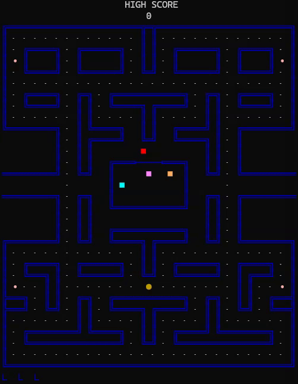
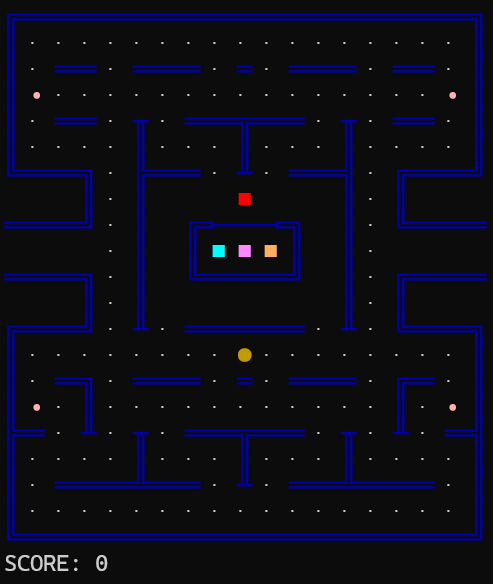
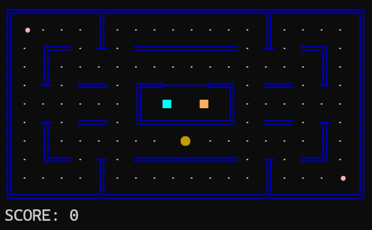
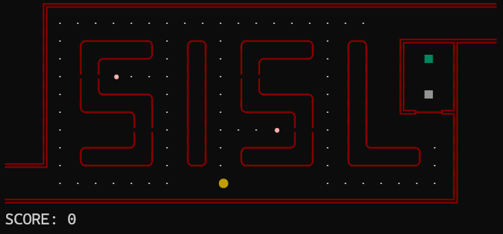
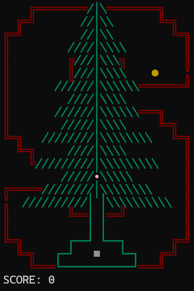

# PacMan.jl 

The game of PacMan in the Julia REPL.

<p align="center">
  
</p>


## Installation
```julia
] add https://github.com/mossr/PacMan.jl
```

## Gameplay
```julia
using PacMan
play()
```

- Hit `backtick` to pause the game.
- Resume with `play()` or restart the game with `restart()`


## Controls (wasd)
* `a` and `d` to apply left and right velocity
* `s` to apply down velocity
* `w` to apply up velocity
* `backtick` to pause, then `play()` to resume


## Other options
- `play(maze_type=2)`: Change to the 17x19 PocMan maze from Silver et al. (2010).

<p align="center">
  
</p>


- `play(maze_type=3)`: Change to the 9x18 PacMan maze.

<p align="center">
  
</p>


- `play(maze_type=4)`: Change to the SISL maze (Stanford Intelligent Systems Laboratory).

<p align="center">
  
</p>


- `play(maze_type=5)`: Change to the Stanford tree "S" logo maze

> ⚠ Work-in-progress.

<p align="center">
  
</p>


---
[Robert Moss](http://robert-moss.com/)
