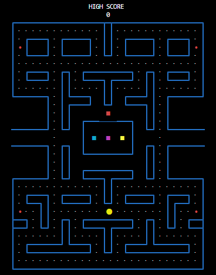

# Pacman.jl 

The game of Pacman in the Julia REPL.

> ⚠ Work-in-progress.

<p align="center">
  
</p>


## Installation
```julia
] add https://github.com/mossr/Pacman.jl
```

## Gameplay
```julia
using Pacman
```
The game will start automatically.
- Hit `backtick` to pause the game.
- Resume with `play()` or restart the game with `restart()`


## Controls (wasd)
* `a` and `d` to apply left and right velocity
* `s` to apply down velocity
* `w` to apply up velocity
* `backtick` to pause, then `play()` to resume


---
[Robert Moss](http://robert-moss.com/)
